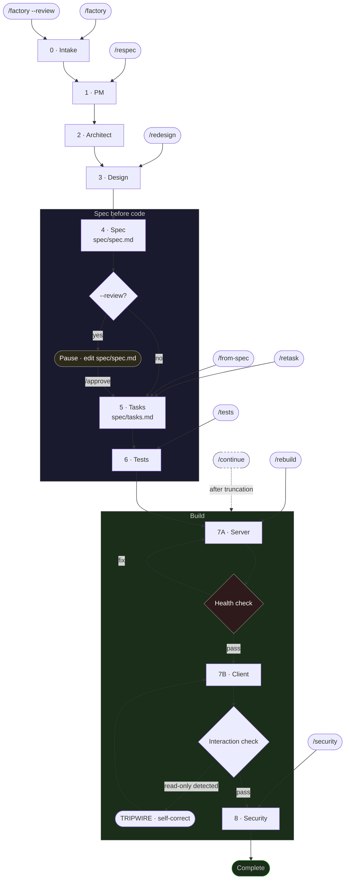

# Ship it Ship-it-Ralph

> A spec-driven AI Skill that turns a one-line idea into a working full-stack app.

> ```/factory``` YOUR 1-SENTENCE IDEA
→ Working app at localhost:5173

## In 30 seconds
Ship-it-Ralph is a **[Skill](https://github.com/swamichandra/ship-it-ralph/blob/main/SKILL.md)** target for [GitHub Copilot](https://code.visualstudio.com/docs/copilot/overview), [Cursor](https://cursor.com/), [Claude Code](https://claude.com/product/claude-code), and [Google Antigravity](https://antigravity.google/). It runs the **Ralph Wiggum Loop** autonomously: **spec first**, then tasks, **tests before code**, then server and client, then a security pass. Nothing implements against the prompt alone — everything traces to `spec/spec.md` and `spec/tasks.md`.


**Authoritative policy:** **[`SKILL.md`](SKILL.md)** at the repository root. Paths such as `references/...` inside it are always relative to the folder that contains `SKILL.md` — see **Path contract** in that file.

**Where to install the bundle** (`SKILL.md` + `references/`, same layout everywhere):

| Location | Use when |
|----------|----------|
| **`your-workspace/.agents/<skill-name>/`** | **Default.** Install **inside the folder you open as the workspace** (your project root). Example: **`.agents/ship-it-ralph/SKILL.md`** and **`.agents/ship-it-ralph/references/`** — pick any **`<skill-name>`** folder name. |
| **`your-workspace/.github/`** | Optional — e.g. GitHub Copilot layouts (**`.github/SKILL.md`** + **`.github/references/`**). |

Do **not** rely on a lone **`SKILL.md`** sitting directly under **`.agents/`** with no subfolder; keep the bundle inside **`.agents/<skill-name>/`**.

**Capabilities:** nine phases, partial reruns, run modes (`--fast` / `--advanced`), verification discipline, full-factory-run chat banner rules, and tripwire rules.

Why teams use it: spec-first generation (`spec/spec.md` before code), tests before implementation, and explicit quality gates that prevent "looks done" but non-interactive outputs.

---

## Contents

- [Quick start](#-quick-start)
- [What's in the box](#whats-in-the-box)
- [What gets created](#what-gets-created)
- [The nine phases](#the-nine-phases)
- [Commands & controls](#commands--controls)
- [Run modes](#run-modes)
- [Flags and combinations](#flags-and-combinations)
- [Hybrid context mode](#hybrid-context-mode)
- [After the build](#after-the-build)
- [Detailed user guide](#detailed-user-guide)
- [Example ideas](#example-ideas)
- [Limitations](#limitations)
- [Repo layout](#repo-layout)

---

## ⚡ Quick start
*Ship-it-Ralph is purpose-built for one thing: a developer with an idea who wants a running, specced, tested full-stack app in one autonomous session.*

**Prerequisites:** [Node.js 22](https://nodejs.org), [npm](https://www.npmjs.com/), and an agent-capable IDE: GitHub Copilot (VS Code), Cursor, Claude Code, or Google Antigravity.

### Install

In this repository the bundle lives at the **root**: **`SKILL.md`**, **`references/`**, and optional **`assets/`**, **`scripts/`**, **`evals/`**. There is **no npm package** — copy those files into **your workspace** under **`.agents/<skill-name>/`** (see table above). Replace **`ship-it-ralph`** below with any folder name you want under **`.agents/`**.

```bash
git clone https://github.com/swamichandra/ship-it-ralph
cd ship-it-ralph

# Set to the folder you open as your IDE workspace (project root)
WORKSPACE=/path/to/your-workspace
mkdir -p "$WORKSPACE/.agents/ship-it-ralph"
cp SKILL.md "$WORKSPACE/.agents/ship-it-ralph/"
cp -r references "$WORKSPACE/.agents/ship-it-ralph/"
# optional: cp -r assets scripts evals "$WORKSPACE/.agents/ship-it-ralph/"
```

```powershell
$src  = "C:\path\to\ship-it-ralph"    # your clone of ship-it-ralph
$workspace = "C:\path\to\your-workspace"  # folder you open in the IDE
$dest = Join-Path $workspace ".agents\ship-it-ralph"
New-Item -ItemType Directory -Force -Path $dest | Out-Null
Copy-Item (Join-Path $src "SKILL.md") $dest\
Copy-Item (Join-Path $src "references") (Join-Path $dest "references") -Recurse
```

**Optional — `.github/` instead of or in addition to `.agents/`** (e.g. Copilot): same files under **`your-workspace/.github/`**.

### Run the factory

Open your agent chat and type:

```text
/factory a subscription tracker that warns before renewals
```

**Optional — scope and depth** (all nine phases still run; modes do not skip tests or security):

```text
/factory --fast a simple two-screen todo app with tags
/factory --advanced a subscription tracker that warns before renewals
/factory --mode normal --review a hiring pipeline tracker
```

- **Phases 0–4** produce `spec/spec.md` (and earlier phase blocks).  
- **Phases 5–6** produce `spec/tasks.md` and Vitest tests **before** any implementation.  
- **Phases 7A–7B** build the server and client.  
- **Phase 8** runs the security pass and verdict.
- **Interaction gate:** generated clients must not be read-only dashboards; require mutation flows (create/edit/delete), feedback states, and at least one actionable AI accept/reject flow.

The skill is written to run **without clarifying questions** unless you choose human review.

Need token-efficient phase context on longer runs? See **[Hybrid context mode](#hybrid-context-mode)**.

### Review spec before building

```text
/factory --review a subscription tracker that warns before renewals
```

When `spec/spec.md` is ready, edit the file if needed, then:

```text
/approve
```

Execution continues from Phase 5 through 8.

### Run the generated app

```bash
npm run install:all && npm run dev
```
- Client → `http://localhost:5173`  
- API → `http://localhost:3001` (see generated config and `references/STACK.md` beside your installed `SKILL.md`)

**Path contract:** In `SKILL.md`, paths like `references/STACK.md` are relative to the folder that contains `SKILL.md` (**repository root** in this repo, or **`your-workspace/.agents/<skill-name>/`** / **`.github/`** after install).

**Where the generated app goes:** New factory runs target `../ralph-apps/[prefix]-[slug]` (sibling of your project folder). If your environment blocks writes above workspace root, edit **`RUN BOOTSTRAP -> Location rule`** in your installed **`SKILL.md`** and change `../ralph-apps/` to `./ralph-apps/`.

---

## What's in the box

| Document | Role |
|----------|------|
| **[`SKILL.md`](SKILL.md)** | **Source of truth** in this repo — phases, commands, run modes, verification, chat banner, tripwire, bootstrap. After install: **`your-workspace/.agents/<skill-name>/SKILL.md`** (recommended) or **`.github/SKILL.md`**. |
| **[`references/`](references/)** | Design system, stack layout, constitution patterns — always next to `SKILL.md` (e.g. **`.agents/<skill-name>/references/`**). |
| **[`orchestrator/`](orchestrator/)** | Optional execution layer: per-phase files, pruning rules, memory episodes/patterns, verification checklist. |
| **[`docs/USER_GUIDE.md`](docs/USER_GUIDE.md)** | Scenario-based walkthrough: first run, `--review`, modes, partial commands, truncation, troubleshooting. |
| **[`docs/ORCHESTRATOR_GUIDE.md`](docs/ORCHESTRATOR_GUIDE.md)** | How to run with/without the orchestrator layer. |
| **[`docs/ARCHITECTURE.md`](docs/ARCHITECTURE.md)** | Layered architecture and authority model. |
| **[`.github/README.md`](.github/README.md)** | Note for anyone browsing the old `.github`-only layout. |

If anything disagrees, follow **`SKILL.md`** wherever you installed it (**repository root**, **`.agents/<skill-name>/`**, **`.github/`**, or another folder — see **Path contract** in `SKILL.md`). Do not put **`SKILL.md`** alone at **`your-workspace/.agents/`** with no **`<skill-name>`** subfolder.

---

## What gets created

After a full factory run (phases 0–8), you typically get:

| Output | Purpose |
|--------|---------|
| `spec/spec.md` | Contract — entities, routes, screens, stack |
| `spec/tasks.md` | Atomic tasks (server block, then client) — count follows scope formula in `SKILL.md` |
| `tests/` | Vitest — written before the server exists (failing first is expected) |
| `server/` | Express, SQLite (libsql), CRUD routes |
| `client/` | React, Vite, Tailwind, Ralph Design System |
| `constitution.md` | Project rules (first artifact in Phase 7A) |
| `.ralph/` (orchestrated runs) | Under the **generated app** root: briefs, memory episodes — see `SKILL.md` / orchestrator |

---

## The nine phases

| # | Phase | What it does |
|---|--------|----------------|
| 0 | Intake | Plain-English restatement; optional `FACTORY_MODE` (`fast` / `normal` / `advanced`) |
| 1 | PM | Product name, jobs-to-be-done, MVP scope (**fast**: up to 3 MVP features) |
| 2 | Architect | Stack, entities, routes (**fast**: max 2 entities; charts usually off) |
| 3 | Design | Screens, slugs, Ralph Design System (**fast**: max 3 screens) |
| 4 | Spec | Writes `spec/spec.md` (**advanced**: adds Assumptions + Risks sections) |
| 5 | Tasks | Writes `spec/tasks.md` (task count scales: base 12-18 for 2 entities/3 screens, +3 per extra entity, +1 per extra screen) |
| 6 | Tests | Vitest specs before server code |
| 7A | Server | Express + SQLite; health check before 7B |
| 7B | Client | React + Vite + Tailwind; mutation flows required (create/edit/delete + loading/success/error states) |
| 8 | Security | Findings, auto-fixes, **SHIP / SHIP_WITH_NOTES / DO_NOT_SHIP** |

The diagram below shows how partial commands re-enter the main flow.



---

## Commands & controls

| Trigger | Phases | Use when |
|---------|--------|----------|
| `/factory` | 0–8 | Greenfield idea → full app |
| `/factory --review` | 0–4 pause, then 5–8 | You want to edit `spec/spec.md` before build (then continue with `/approve`) |
| `/approve` | Resume 5–8 after review pause | Requires a prior `--review` pause; if no active review session exists, use `/from-spec` |
| `/from-spec` | 5–8 | You already have `spec/spec.md` |
| `/tests` | 6 | Regenerate tests from `spec/spec.md` + `spec/tasks.md` |
| `/security` | 8 | Re-audit after manual edits |
| `/continue` | Resume 7A or 7B | After “Ralph got sleepy” truncation |
| `/retask` | 5 | You edited `spec/spec.md`; refresh `spec/tasks.md` only |
| `/respec` | 1–5 | New scope or idea; new spec + tasks, no code |
| `/rebuild` | 7A, 7B, 8 | Rebuild code from current `spec/spec.md` + `spec/tasks.md` |
| `/redesign` | 3, 7B | Server OK; new UI only |

Prerequisites and exact emit strings are defined in **[`SKILL.md`](SKILL.md)** (COMMAND MAP and PHASE TRIGGERS).

---

## Run modes

Modes adjust **scope** (fewer features/screens in **fast**) and **depth** (**advanced** spec + security + test reporting). They **do not** remove Phase 6 or Phase 8.

| Mode | Flag | Summary |
|------|------|---------|
| **fast** | `--fast` or `--mode fast` | Tighter MVP caps: fewer features, entities, screens, seed rows; charts usually off |
| **normal** | default or `--mode normal` | Standard factory behavior |
| **advanced** | `--advanced` or `--mode advanced` | Assumptions + risks in `spec/spec.md`, richer security findings, honest `npm test` reporting when runnable |

Combine with `--review` as needed.

---

## Flags and combinations

Examples:

```text
/factory --fast an idea that should stay tiny
/factory --advanced an idea you will harden before shipping
/factory --review --advanced a product you need to vet carefully
/from-spec --advanced
```

Partial runs with `--mode` are described under **RUN MODES** and **Partial runs** in [`SKILL.md`](SKILL.md).

---

## Hybrid context mode

Ship-it-Ralph supports a hybrid setup for long runs and tighter phase-local context:

- **Canonical policy layer:** `SKILL.md` (this repository: root **`SKILL.md`**; your workspace: **`.agents/<skill-name>/SKILL.md`** or **`.github/SKILL.md`**)
- **Optional execution layer:** `orchestrator/` in this repo (pruning + memory; run artifacts for the **generated app** live under **`.ralph/`** inside the app directory — see `SKILL.md` and `docs/ORCHESTRATOR_GUIDE.md`)

### Precedence rules (explicit)

1. `SKILL.md` wins for commands, run modes, phase order, contracts, and output formats.
2. `orchestrator/` controls context loading mechanics only (what to read, what to ignore, brief handoffs, memory loading).
3. `references/*` next to `SKILL.md` are loaded per phase by pruning rules.

If there is a conflict, always follow **`SKILL.md`**.

### How to run hybrid mode

Open your agent chat and run:

```text
Read orchestrator/ORCHESTRATOR.md and run /factory in orchestrated mode with your installed SKILL.md (e.g. `.agents/<skill-name>/SKILL.md` or `.github/SKILL.md`) as authority.
```

Then use the same `/factory` command variants shown in Quick Start (`--fast`, `--advanced`, `--review`) based on your scope and review needs.

---

## After the build

Read **`spec/spec.md`** first — it is the contract for what was built.

| File | Typical next step |
|------|-------------------|
| `server/db/seed.js` | Replace demo data with real domain data |
| `client/src/pages/` | Tweak labels, layout, fields |
| `server/db/schema.js` | Switch from in-memory to file DB if you need persistence |
| `constitution.md` | Amend before onboarding more developers or re-running the factory |

---

## Detailed user guide

For step-by-step scenarios (first run, review flow, modes, partial commands, truncation, troubleshooting), see **[`docs/USER_GUIDE.md`](docs/USER_GUIDE.md)**.

Keeping the README as the **overview and reference index** and the user guide as **walkthroughs** avoids a single 500-line file and stays friendly for newcomers and for printing or sharing.

---

## Example ideas

```text
/factory a subscription tracker that warns before renewals
/factory a hiring pipeline tracker for a recruiting team
/factory a restaurant menu and order management system
/factory a reading list tracker with notes and ratings
/factory a demand forecasting dashboard for retail buyers
/factory a pet care log for a veterinary clinic
/factory an equipment maintenance tracker for a facilities team
/factory a recipe manager with ingredient inventory
/factory a conference talk submission and review tool
/factory a freelancer invoice and payment tracker
/factory a neighborhood watch incident log
/factory a book club reading schedule with discussion notes
/factory a gym class booking system for a small studio
/factory an API key and credential inventory for a dev team
/factory a plant watering tracker with care instructions
```

---

## Limitations

Ship-it-Ralph targets **MVPs**. It does **not** fully generate out of the box:

- OAuth / full auth stacks (auth is **none** by default)
- Stripe or other payment providers
- File uploads or WebSockets

Those are marked **`[RALPH DEFERRED]`** in code with TODOs — **max three per run**. A fourth deferred item triggers a scope-split recommendation, so larger ideas should be split across multiple factory runs.

---

## Repo layout

```
<repository root>               ← [ship-it-ralph](https://github.com/swamichandra/ship-it-ralph) on GitHub
├── README.md                   ← overview and install
├── SKILL.md                    ← phases, commands, modes, verification (authoritative policy)
├── assets/                     ← optional skill assets
├── scripts/                    ← optional helper scripts
├── evals/                      ← eval prompts and regressions
└── references/
    ├── DESIGN_SYSTEM.md        ← Ralph Design System (Eclipse Edition)
    ├── STACK.md                ← Express, Vite, libsql, Vitest templates
    └── CONSTITUTION.md         ← constitution patterns

.github/
└── README.md                   ← note: skill files live at repo root, not under .github/ here

orchestrator/
├── ORCHESTRATOR.md          ← execution loop with SKILL precedence
├── phases/                  ← phase-local runners/instructions
├── pruning/                 ← context-rules + verification-checks
├── memory/                  ← loader templates + patterns (seed for `.ralph/memory/` in the app)
└── scripts/episode-writer.js← helper; writes episodes under app `.ralph/memory/episodes/`

(App runtime state during orchestrated runs: **`generated-app/.ralph/briefs/`** and **`generated-app/.ralph/memory/`** — not under `orchestrator/` in the repo.)

docs/
├── USER_GUIDE.md            ← scenario-based walkthrough
├── ORCHESTRATOR_GUIDE.md    ← run with/without wrapper
└── ARCHITECTURE.md          ← authority and layering
```

**After install** in your workspace you typically have **`your-workspace/.agents/<skill-name>/SKILL.md`** and **`your-workspace/.agents/<skill-name>/references/`**. Optional: the same bundle under **`.github/`** instead or as well.

PRs welcome. Test substantive changes to `SKILL.md` against multiple ideas before submitting.

[Issues](https://github.com/swamichandra/ship-it-ralph/issues) · MIT License

---

*Ship it Ship-it-Ralph · Swami Chandrasekaran*
