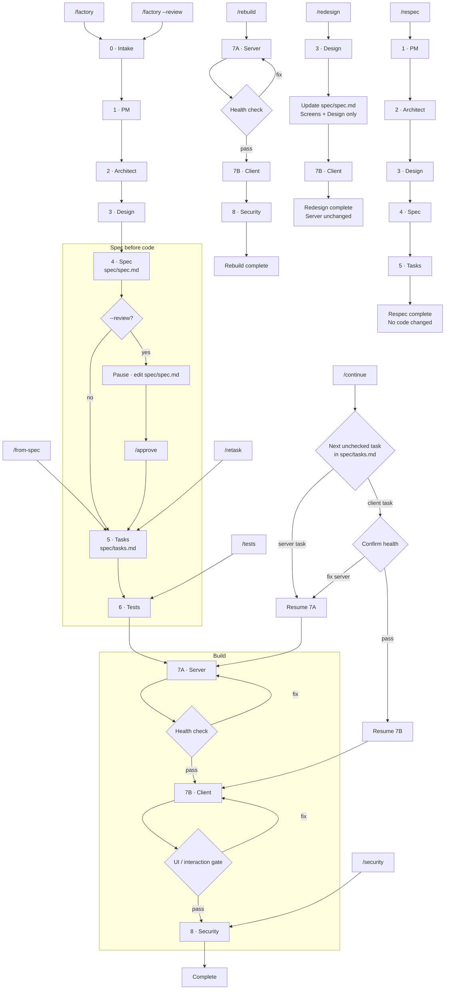

# Ship-it-Ralph

> A spec-driven AI Skill that turns one one-line idea / sentence into a working full-stack app.

```text
/factory YOUR 1-SENTENCE IDEA
```
→ spec → tasks → tests → server → client → security
→ Working app at localhost:5173

Ship-it-Ralph runs the [**Ralph Wiggum Loop**](https://ghuntley.com/loop/) autonomously. It writes the spec first, breaks the work into tasks, writes tests before code, builds the server, confirms the API is healthy, then builds the client against the spec — not against the original prompt.  

Works with [GitHub Copilot](https://code.visualstudio.com/docs/copilot/overview), [Cursor](https://cursor.com/), [Claude Code](https://claude.com/product/claude-code), and [Google Antigravity](https://antigravity.google/).


---

## Why it exists

Most AI coding workflows jump straight from prompt to code. That usually means shallow product thinking, fuzzy scope, and UI that looks like a generic dashboard.

Ship-it-Ralph is built around [**Spec-Driven Development**](https://martinfowler.com/articles/exploring-gen-ai/sdd-3-tools.html):

- define the product before writing code
- make the spec the source of truth
- derive tasks and tests from the spec
- force the build to prove itself in phases

A sharp spec produces a sharp app. A vague spec produces a vague app. Ralph makes that visible early.

---

## What makes this version different

This version is stricter about product thinking, AI-native behavior, and design quality.

- **Better PM + architect thinking.** Ralph should not stop at the obvious CRUD version of an idea. It should push into adjacent, credible product moves that sharpen the core job without turning the app into a bloated science project.
- **Real AI-native UX.** If the idea implies AI, the app must show it in the interface through visible actions, review flows, and accept/reject or edit-and-commit moments. Decorative “AI-powered” labels do not count.
- **More opinionated design.** The factory rejects the default SaaS shell and pushes toward stronger layout, clearer screen ideas, and more intentional interaction design.
- **Light mode by default for productivity apps.** Planning, writing, task, workflow, and day-to-day tools should usually open in light mode unless the concept strongly calls for dark.

These defaults are enforced through `SKILL.md`, `references/DESIGN_SYSTEM.md`, and `references/ANTI_GENERIC_UI.md`.

---

## Quick start

### 1. Install

Clone this repo and copy it into your workspace. No package install is needed for the skill itself.

```bash
git clone https://github.com/swamichandra/ship-it-ralph
cd ship-it-ralph

WORKSPACE=/path/to/your-workspace
mkdir -p "$WORKSPACE/.agents/ship-it-ralph"
cp -r . "$WORKSPACE/.agents/ship-it-ralph/"
rm -rf "$WORKSPACE/.agents/ship-it-ralph/.git"
```

Also works under `.github/` for setups that prefer GitHub Copilot-style skill loading.

### 2. Run it

```text
/factory a subscription tracker that warns before renewals
```

### 3. Optional: review the spec before build

```text
/factory --review a subscription tracker that warns before renewals
# edit spec/spec.md if needed, then:
/approve
```

### 4. Run the generated app

```bash
npm run install:all && npm run dev
```

- client → `http://localhost:5173`
- server → `http://localhost:3001`
- tests → `npm run dev:server` then `npm test`

Generated apps land in `../ralph-apps/[prefix]-[slug]` by default. If your environment blocks writing above the workspace root, change the location rule in `SKILL.md` to use `./ralph-apps/` instead. 

---

## The loop

Ship-it-Ralph runs nine phases in order:

1. **Intake** — restates the idea plainly and sets mode
2. **PM** — locks user, problem, jobs, MVP
3. **Architect** — defines entities, routes, stack, charts
4. **Design** — defines layout, screen ideas, interaction model, anti-generic intent
5. **Spec** — writes `spec/spec.md`
6. **Tasks** — writes `spec/tasks.md`
7. **Tests** — writes tests before implementation
8. **Server** — builds Express + libsql and verifies health
9. **Client + Security** — builds the UI, checks interaction quality, runs the security pass

The key discipline is simple: **nothing builds against the prompt alone**. Everything traces back to the spec and task list. 

---

## Commands

### Full runs

| Trigger | What it does |
|---|---|
| `/factory [idea]` | Full greenfield run |
| `/factory --review [idea]` | Stops after spec so you can edit before build |
| `/factory --fast [idea]` | Reduced scope |
| `/factory --advanced [idea]` | Deeper spec + stricter security + test evidence |

### Partial runs

| Trigger | What it does |
|---|---|
| `/approve` | Continue after `--review` |
| `/from-spec` | Build from existing `spec/spec.md` |
| `/respec [idea]` | Rewrite spec and tasks only |
| `/rebuild` | Rebuild server and client from current spec + tasks |
| `/redesign` | Keep the server, replace the client design |
| `/retask` | Regenerate tasks from the spec |
| `/tests` | Regenerate tests only |
| `/security` | Run the security pass only |
| `/continue` | Resume after token truncation |

All of these are defined in `SKILL.md`. 


### Optional: Lower-token execution with the orchestrator
For long or interruption-prone runs, you can ask the agent to use the orchestrator layer. It executes the factory phase by phase, loads only the context needed for the current step, verifies before advancing, and makes recovery flows cleaner. To use it, say: `Read orchestrator/ORCHESTRATOR.md and run the factory with SKILL.md precedence.` The orchestrator changes how the factory executes, not what the factory is. For short, simple runs, the standard factory invocation is usually enough. The orchestrator is most helpful when the build is long enough that phase-local execution becomes a real advantage.

---

## Run modes

### `--fast`

For smaller builds. Ralph keeps the app tight:
- up to 3 MVP features
- up to 2 entities
- up to 3 screens
- fewer seed records

### default

The normal mode for most ideas.

### `--advanced`

Same general product scope, but with more rigor:
- adds assumptions and risks to the spec
- produces a deeper security section
- requires honest test evidence when commands can run

Modes tune scope and depth. They do **not** skip phases. Tests and security always run. 

---

## What gets created

```text
spec/
  spec.md
  tasks.md
tests/
  api.test.js
  seed.test.js
server/
  Express + libsql
client/
  React + Vite + Tailwind
constitution.md
.ralph/
  build memory and orchestration internals
```

Every generated app is a small, inspectable project with a durable spec at the center. 

---

## Design System

Ship-it-Ralph does not aim for “modern SaaS.” It aims for software that feels intentional.

That means:
- no default KPI-card dashboard shell
- no symmetrical card grid as the whole product
- no vague “clean UI” direction
- every screen needs a strong idea
- layout must be explicit, not implied
- at least one memorable hook must be implemented
- motion should communicate state, not decorate the screen

The anti-generic contract is what keeps the build from collapsing into the same card-and-chart layout models tend to produce by default. fileciteturn0file2

### Light vs dark

The design system supports both themes. The current default should follow the product:
- **light first** for productivity, planning, writing, workflow, and operating tools
- **dark first** only when the concept genuinely benefits from it

Either way, the theme should be set before first paint and ModeToggle should always be available. The design system handles the tokens; the layout contract handles the overall shell. fileciteturn0file4turn0file2

---

## AI-native bar

When an idea implies AI, Ralph should treat that as a product requirement, not a branding flourish.

An AI-native app must show its value in the UX through things like:
- draft generation
- suggestions the user can accept or reject
- rewrite or regenerate flows
- scheduling or prioritization proposals
- review queues
- AI-assisted state changes tied to real records

Stubbed behavior is fine. Fake value is not.

The user should be able to **see the AI think, review the output, and decide what happens next**. The design system includes patterns for skeletons, optimistic updates, streaming text, and ambient indicators to support that. fileciteturn0file1turn0file4

---

## What Ralph will not build by default

These stay deferred unless you intentionally split scope or extend the factory:

- OAuth and full auth
- payments
- email
- file uploads
- websockets

Deferred features are marked in code with a Ralph comment block and TODO instructions. Too many deferred systems in one run should trigger a scope split instead of a half-built app. 

---

## Repo layout

```text
SKILL.md
references/
  DESIGN_SYSTEM.md
  ANTI_GENERIC_UI.md
  STACK.md
  CONSTITUTION.md
optional:
  orchestrator/
  docs/
  assets/
  scripts/
  evals/
```

`SKILL.md` is the source of truth. The files under `references/` support it:
- `DESIGN_SYSTEM.md` defines tokens, components, and AI-native UI primitives
- `ANTI_GENERIC_UI.md` defines layout, composition, tension, and rejection rules
- `STACK.md` defines implementation templates
- `CONSTITUTION.md` explains how generated constitutions should be written

All paths resolve relative to the folder that contains `SKILL.md`. fileciteturn0file1turn0file2turn0file3turn0file4

---

## Good prompts for Ralph

Ralph works best when the idea names the user, the job, and the core action.

Better:

```text
/factory an AI-native follow-up planner for solo consultants who keep forgetting to close loops after client calls
```

Weaker:

```text
/factory make me a productivity app
```

You do not need to over-prompt. But you do need to be concrete.

---

## When to use `/redesign`

Use `/redesign` when the server is good but the experience is not.

That is the right move when:
- the app works, but the layout feels generic
- the screens exist, but do not express a strong concept
- the AI surfaces are too hidden or too decorative
- the theme choice feels wrong for the product
- the shell lacks rhythm, tension, or clarity

`/redesign` should keep the backend intact and rebuild the client around a better Phase 3. fileciteturn0file1turn0file2


---
## Flow of a Ralph Run

---

## Limitations

Ship-it-Ralph is for MVPs. It is opinionated, narrow, and deliberately constrained.

That is the point.

It is not trying to replace product strategy, engineering judgment, or design craft. It is trying to make those things legible and executable inside an AI-assisted build loop.

---

## Docs

| Need | File |
|---|---|
| Full phase rules | `SKILL.md` |
| Design tokens and components | `references/DESIGN_SYSTEM.md` |
| Layout and anti-template rules | `references/ANTI_GENERIC_UI.md` |
| Constitution guidance | `references/CONSTITUTION.md` |

---

PRs welcome. Test changes against multiple ideas before merging.

[Issues](https://github.com/swamichandra/ship-it-ralph/issues) · MIT License

---

*Ship-it-Ralph · Swami Chandrasekaran*
