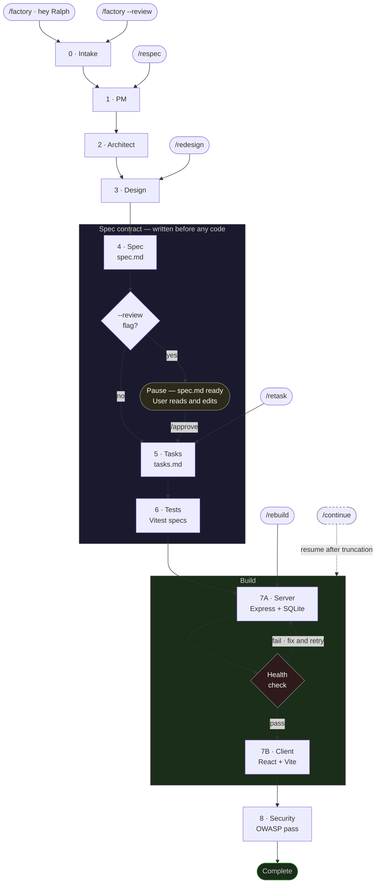

# Ship it Ralph
**A spec-driven AI Skill that turns one sentence into a working full-stack app.**

AI makes writing code fast — but without a spec, fixing almost-working code takes longer than building it from scratch.

Ralph is a **Skill** for GitHub Copilot, Cursor, Claude Code, and Google Antigravity that runs the entire loop *autonomously* — spec first, code last, nothing left to chance. Type one sentence. Get a tested working app.

Ralph follows *Spec-Driven Development* through the Ralph Wiggum Loop (nine autonomous phases) — writing the spec before the code, breaking it into tasks, writing tests against those tasks, then building. Every file generated against a contract.

That is the difference. Not a faster way to prompt. A different way to build.

*For developers who want an app built right, not just built fast.*


---

## Quick start

Requires [Node.js 22](https://nodejs.org) and one of: GitHub Copilot (VS Code), Cursor, Claude Code, or Google Antigravity in agent mode.

```bash
# 1. Install Ralph as an agent skill in your workspace
git clone https://github.com/swamichandra/ship-it-ralph
cp -r ship-it-ralph/.github your-workspace/
# Copies one folder. Nothing installed globally.
```

```bash
# 2. Open agent chat and type your idea
/factory a subscription tracker that warns before renewals
# Phases 0–4 write spec.md, tasks.md, and tests — before any code is written.
# Phases 7A–7B build the server and client against the spec.
# No follow-up questions.
```

```bash
# 3. Start the app
cd my-app && npm run install:all && npm run dev
# Client → localhost:5173   API → localhost:3001
```

---

## In 30 seconds

```
Output from: /factory a subscription tracker that warns before renewals

  spec.md         source of truth — entities, routes, screens
  tasks.md        build plan — 15 atomic tasks derived from the spec
  tests/          definition of done — Vitest specs written before the server
  server/         Express API, SQLite, 5 CRUD routes per entity
  client/         React + Vite + Tailwind, dark and light mode, charts

  npm run dev → localhost:5173
```

---

## What this is

Ralph is a structured Skill file — a single markdown document in your `.github/` folder that instructs your AI agent how to build a full-stack app from one idea. Type `/factory [idea]` in agent mode and it runs a nine-phase autonomous loop: spec and task list first, tests against them, then code against all three. Files written to disk one at a time. No follow-up prompts.

The quality of the output is determined by the quality of the spec — not the quality of your prompt. That distinction is the entire design.

---

## Why specs enable autonomy

Ralph eliminates guessing by producing three artifacts before any implementation runs:

**spec.md** — every entity and its fields, every API route and its expected shape, every screen and its purpose. Written in phase 4, before the engineer phase has touched a file.

**tasks.md** — the spec decomposed into 12–18 atomic tasks. Not "build the frontend" — build `InvoiceList.jsx`, build `POST /api/invoices`. Each task is one file or one verifiable behavior.

**tests/** — Vitest specs written in phase 6, from the task list, before the server exists. They define what "done" means for each job. They will fail until the build completes. That is the intended sequence.

When phase 7 runs, the agent is not guessing. It has a spec that defines every entity, a task list that defines the build order, and tests that define the acceptance criteria. A clear spec produces a complete app. A vague spec produces a vague app.

This is why the input is one sentence. The first phase restates your idea in plain language — if it cannot be explained simply, it cannot be specced precisely, and it cannot be built autonomously.

---

## Why Ship it Ralph

**The spec is generated, not required.** Every other tool asks you to write or co-author the spec. Ralph produces it from your one-sentence idea. You do not need to know how to write a specification document to get a complete one.

**Zero install.** Copy one folder. No CLI, no global npm package, no new IDE, no account. Works inside the tools you already use.

**Tool-agnostic and autonomous.** Spec Kit is tool-agnostic but manually orchestrated. Kiro is automated but tied to one IDE. Ralph is both — one skill file, any agent tool, fully autonomous run.

**Tests before code, enforced by the loop.** Phase 6 writes Vitest specs before phase 7 runs. This is not a recommendation — it is the order the phases execute. No other tool in this category enforces test-first sequencing structurally.

**A running app, not a plan.** Spec Kit, BMAD, and Kiro produce specifications and task lists. Ralph produces a running React + Node app you can open in a browser. The spec, tasks, and tests are byproducts of building it — not the deliverable.

Ralph is purpose-built for one thing: a developer with an idea who wants a running, specced, tested full-stack app in one autonomous session.

---

## TL;DR — the phases

| # | Phase | What it does |
|---|---|---|
| 0 | Intake | Restates your idea in plain English. Catches vague specs before they become bad code. |
| 1 | PM | Locks the product name, jobs-to-be-done, and five MVP features. Nothing more. |
| 2 | Architect | Decides the stack, data entities, and every API route. |
| 3 | Design | Defines the screens, their slugs, and the visual system. |
| 4 | Spec | Writes `spec.md` — the source of truth. Everything downstream builds against this. |
| 5 | Tasks | Breaks the spec into 12–18 atomic tasks. One task = one file or one behavior. |
| 6 | Tests | Writes Vitest specs from the task list — before the server exists. They will fail. That is correct. |
| 7A | Server | Builds Express, SQLite, routes. Confirms the server starts before touching the client. |
| 7B | Client | Builds React, Vite, Tailwind, all screens. Against the spec, not the original prompt. |
| 8 | Security | OWASP pass, auto-fixes, verdict: SHIP / SHIP WITH NOTES / DO NOT SHIP. |

---

## How it works



---

## Optional: review the spec before building

By default the factory runs straight through. To pause after `spec.md` is written:

```
/factory --review a subscription tracker that warns before renewals
```

The factory writes `spec.md` and stops. Read it. Edit it directly if anything is wrong. Type `/approve` to continue — the build picks up any edits and runs fully autonomous from that point.

---

## Re-run a phase

All triggers require `spec.md` in the project root.

| Trigger | Reruns | Use when |
|---|---|---|
| `--review` + `/approve` | Phases 0–4, pause, then 5–8 | Review spec before building |
| `/redesign` | Phase 3 + 7B | Server works, want different layout or screens |
| `/respec` | Phases 1–5 | Expanding scope — no code touched |
| `/rebuild` | Phases 7A + 7B + 8 | Last build truncated or spec was edited |
| `/retask` | Phase 5 | Edited `spec.md` manually, need `tasks.md` to match |

---

## After the build

Read `spec.md` before touching anything. It documents what was built and why.

| File | Why |
|---|---|
| `server/db/seed.js` | Replace demo records with data from your real domain |
| `client/src/pages/` | Edit labels, fields, and layout per screen |
| `server/db/schema.js` | Change `':memory:'` to `'file:local.db'` for persistence |
| `constitution.md` | Amend before adding a developer or running the factory again |

---

## Tool setup

**GitHub Copilot** — Open Copilot Chat. Switch the dropdown from Ask to Agent.

**Cursor** — Open Chat. Switch to Agent mode in the top bar.

**Claude Code** — Add `.github/SKILL.md` as a project memory or reference it in your `CLAUDE.md`.

**Google Antigravity** — Create `.agents/skills/ship-it-ralph/` in your workspace. Copy `SKILL.md` there. Put the three reference files in a `resources/` subfolder.

---

## More ideas

```
/factory an internal bug tracker for a small dev team
/factory a client portal for a consulting firm
/factory a demand forecasting dashboard for retail buyers
/factory a personal finance tracker with category breakdowns
/factory a hiring pipeline tracker for a recruiting team
/factory an event RSVP tool with waitlist and attendance
```

---

## Limitations

The factory does not generate OAuth, payments, email, file uploads, or websockets. When one comes up, it marks the spot in the code with a note on what it is and how to add it. Maximum three per run — larger ideas should be split across two factory runs.

API tests require a running server. Run `npm run dev:server` before `npm test`.

---

## Repo

```
.github/
├── SKILL.md                 ← the factory
└── references/
    ├── DESIGN_SYSTEM.md     ← Ralph Design System — Eclipse Edition
    ├── STACK.md             ← Express, Vite, libsql, Vitest templates
    └── CONSTITUTION.md      ← constitution writing guide
```

PRs welcome. Test any change to `SKILL.md` against three different ideas before submitting.

[Issues](https://github.com/swamichandra/ship-it-ralph/issues) · MIT License

---

*Ship it Ralph · v1.0.0 · Swami Chandrasekaran*
