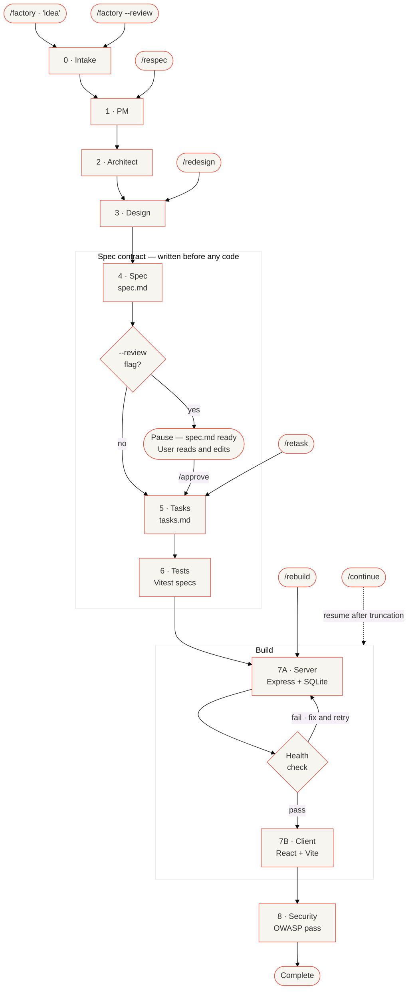

# Ship it Ship-it-Ralph
**A spec-driven AI Skill that turns one sentence idea into a working full-stack app.**

Ship-it-Ralph is a **Skill** for GitHub Copilot, Cursor, Claude Code, and Google Antigravity that runs the entire loop *autonomously* — spec first. 

It follows *Spec-Driven Development* and using as needed through the *Ralph Wiggum Loop* (nine autonomous phases). It forces the AI to stop guessing. Ship-it-Ralph won't touch a line of implementation until it has written the Spec, mapped the Tasks, and generated the Tests. Every file generated against a contract.


---

## ⚡️Quick start
*Ship-it-Ralph is purpose-built for one thing: a developer with an idea who wants a running, specced, tested full-stack app in one autonomous session.*

**Prerequisites**
[Node.js 22](https://nodejs.org), [npm](https://www.npmjs.com/) and one of: GitHub Copilot (VS Code), Cursor, Claude Code, or Google Antigravity in agent mode.

**Install**
```bash
# 1. Install Ship-it-Ralph as an agent skill in your workspace
git clone https://github.com/swamichandra/ship-it-ralph
cp -r ship-it-ralph/.github your-workspace/
# Copies one folder. Nothing installed globally.
# You should see `SKILL.md` and 3 reference files in `resources/` subfolder.
```

**Trigger the Factory**
```bash
# 2.  Open your Agent chat (Cursor, Copilot, or Claude Code) and type:
/factory a subscription tracker that warns before renewals
```

- Phases 0–4 will write spec.md, tasks.md, and tests — before any code is written.
- Phases 7A–7B will build the server and client code against the spec.
- No follow-up questions. Run autonomously

**Optionally:**
If you want to pause after the spec is written, perform a human-in-the-loop review and edit it before building, run with the ```--review``` flag. Ship-it-Ralph pauses after spec.md is written. Make edits. Then type `/approve` to continue.
```
/factory --review a subscription tracker that warns before renewals
```

**Run the app**
```bash
# 3. Start the app
npm run install:all && npm run dev
# Client → http://localhost:5173   API → http://localhost:3001
```

---
## Repo

```
.github/
├── SKILL.md                 ← the factory
└── references/
    ├── DESIGN_SYSTEM.md     ← Ship-it-Ralph Design System — Eclipse Edition
    ├── STACK.md             ← Express, Vite, libsql, Vitest templates
    └── CONSTITUTION.md      ← constitution writing guide
```

---
## The Deliverables
Ship-it-Ralph executes a 9-phase autonomous loop. No follow-up prompts required (unless you run with the --review option). The following will get created:
```
  spec.md         Source of truth — entities, routes, screens
  tasks.md        Build plan — 15 atomic tasks derived from the spec
  tests/          Definition of done. Vitest specs written before server exists
  server/         Express API, SQLite, 5 CRUD routes per entity
  client/         React + Vite + Tailwind, dark/light mode, charts
```
---

## Why Ship-it-Ralph?
**Spec-First** Most coding tools asks you to write or co-author the spec. Ship-it-Ralph produces it from your one-sentence idea. You do not need to know how to write a specification document to get a complete one. If the spec is wrong, you catch it in Phase 4 before a single line of implementation is written. The quality of the output is determined by the quality of the spec — not the quality of your prompt. That distinction is the entire design.

**Zero Install Portability.** Copy one folder. No CLI, no global npm package, no new IDE, no account. Works inside the tools you already use.

**Test-Driven Autonomy** Ship-it-Ralph writes the tests in Phase 6. The build in Phase 7 isn't finished until the tests pass. The AI doesn't "grade its own homework. 

---

## How it works: The 9-Phases

| # | Phase | What it does |
|---|---|---|
| 0 | Intake | Restates your idea in plain English. Catches vague specs before they become bad code. |
| 1 | PM | Locks the product name, jobs-to-be-done, and five MVP features. Nothing more. |
| 2 | Architect | Decides the stack, data entities, and every API route. |
| 3 | Design | Defines the screens, their slugs, and the visual system. |
| 4 | Spec | Writes `spec.md` — the source of truth. Everything downstream builds against this. |
| 5 | Tasks | Breaks the spec into 12–18 atomic tasks. One task = one file or one behavior. |
| 6 | Tests | Writes Vitest specs from the task list — before the server exists. They will fail. That is correct. |
| 7A | Server | Builds Express, SQLite, routes. Confirms the server starts before touching the client. |
| 7B | Client | Builds React, Vite, Tailwind, all screens. Against the spec, not the original prompt. |
| 8 | Security | OWASP pass, auto-fixes, verdict: SHIP / SHIP WITH NOTES / DO NOT SHIP. |



---

##  Commands & Controls

| Trigger | Reruns | Use when |
|---|---|---|
| `/factory` | Phases 0–8 | Run fully autonomously, no human-the-loop|
| `--review` + `/approve` | Phases 0–4, pause, then 5–8 | Review spec before building |
| `/redesign` | Phase 3 + 7B | Server works, want different layout or screens |
| `/respec` | Phases 1–5 | Expanding scope — no code touched |
| `/rebuild` | Phases 7A + 7B + 8 | Last build truncated or spec was edited |
| `/retask` | Phase 5 | Edited `spec.md` manually, need `tasks.md` to match |

---

## After the build

Read `spec.md` before touching anything. It documents what was built and why.

| File | Why |
|---|---|
| `server/db/seed.js` | Replace demo records with data from your real domain |
| `client/src/pages/` | Edit labels, fields, and layout per screen |
| `server/db/schema.js` | Change `':memory:'` to `'file:local.db'` for persistence |
| `constitution.md` | Amend before adding a developer or running the factory again |

---

## A few one line ideas that you can try

```
/factory a subscription tracker that warns before renewals
/factory a hiring pipeline tracker for a recruiting team
/factory a restaurant menu and order management system
/factory a reading list tracker with notes and ratings
/factory a demand forecasting dashboard for retail buyers
/factory a pet care log for a veterinary clinic
/factory an equipment maintenance tracker for a facilities team
/factory a recipe manager with ingredient inventory
/factory a conference talk submission and review tool
/factory a freelancer invoice and payment tracker
/factory a neighborhood watch incident log
/factory a book club reading schedule with discussion notes
/factory a gym class booking system for a small studio
/factory an API key and credential inventory for a dev team
/factory a plant watering tracker with care instructions
```

---

## Limitations

Ship-it-Ralph is a factory for MVPs. It does **not** natively generate:
- OAuth/Auth providers (Auth is none by default)
- Stripe/Payment gateways
- File uploads or WebSockets
- Ship-it-Ralph will mark these as [DEFERRED] in the code with TODO instructions for manual setup.
- Maximum three per run — larger ideas should be split across two factory runs.

API tests require a running server. Run `npm run dev:server` before `npm test`.

---

PRs welcome. Test any change to `SKILL.md` against three different ideas before submitting.

[Issues](https://github.com/swamichandra/ship-it-ralph/issues) · MIT License

---

*Ship it Ship-it-Ralph · v1.0.0 · Swami Chandrasekaran*
