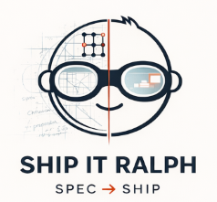
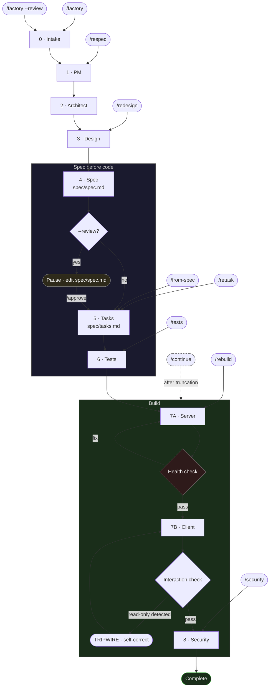

# Ship-it-Ralph

> A spec-driven AI Skill that turns a one-line idea into a working full-stack app.

```
/factory YOUR 1-SENTENCE IDEA  →  working app at localhost:5173
```
Runs the **Ralph Wiggum Loop** autonomously — spec first, tasks, tests before code, server, client, security pass. Nothing builds against the prompt alone; everything traces to `spec/spec.md` and `spec/tasks.md`.



Works with: [GitHub Copilot](https://code.visualstudio.com/docs/copilot/overview), [Cursor](https://cursor.com/), [Claude Code](https://claude.com/product/claude-code), and [Google Antigravity](https://antigravity.google/)

---

## Contents

- [Quick start](#-quick-start)
- [What gets created](#what-gets-created)
- [The nine phases](#the-nine-phases)
- [Commands & controls](#commands--controls)
- [Run modes](#run-modes)
- [After the build](#after-the-build)
- [Example ideas](#example-ideas)
- [Limitations](#limitations)
- [Repo layout](#repo-layout)
- [Docs & advanced options](#docs--advanced-options)

---

## ⚡ Quick start

**Prerequisites:** Node.js 22, npm, and an agent-capable IDE.

### 1. Install

Copy the bundle into your workspace. No npm install.

```bash
# 1. Clone it
git clone https://github.com/swamichandra/ship-it-ralph
cd ship-it-ralph

# Set to your project's root folder
WORKSPACE=/path/to/your-workspace

# 2. Install to your project 
mkdir -p "$WORKSPACE/.agents/ship-it-ralph"
cp -r . "$WORKSPACE/.agents/ship-it-ralph/"
rm -rf "$WORKSPACE/.agents/ship-it-ralph/.git"
```

> **Also works under `.github/`** (e.g. GitHub Copilot). Same files, same layout.

### 2. Run

```text
/factory a subscription tracker that warns before renewals
```

### 3. Review spec before building (optional)

```text
/factory --review a subscription tracker that warns before renewals
# edit spec/spec.md if needed, then:
/approve
```

### 4. Run the generated app

```bash
npm run install:all && npm run dev
```

- Client → `http://localhost:5173`
- API → `http://localhost:3001`
- Tests → `npm run dev:server` then `npm test`

> **Where the app lands:** `../ralph-apps/[prefix]-[slug]` (sibling of your project). If your environment blocks writes above workspace root, edit `RUN BOOTSTRAP → Location rule` in your installed `SKILL.md` and change `../ralph-apps/` to `./ralph-apps/`.

---

## What gets created

| Output | Purpose |
|--------|---------|
| `spec/spec.md` | Contract — entities, routes, screens, stack, **## Design** (palette + anti-generic summary after Phase 3) |
| `spec/tasks.md` | Atomic build tasks (server first, then client) |
| `tests/` | Vitest specs written before the server exists |
| `server/` | Express + SQLite (libsql) + CRUD routes |
| `client/` | React + Vite + Tailwind + Ralph Design System (tokens/components) and Anti-Generic composition from Phase 3 / `spec/spec.md` **## Design** |
| `constitution.md` | Project rules — first artifact written in Phase 7A |

---

## The nine phases

| # | Phase | What it does |
|---|-------|--------------|
| 0 | Intake | Plain-English restatement; sets `FACTORY_MODE` |
| 1 | PM | Product name, jobs-to-be-done, MVP scope |
| 2 | Architect | Stack, entities, routes |
| 3 | Design | Screens, slugs, Ralph Design System + [`references/ANTI_GENERIC_UI.md`](references/ANTI_GENERIC_UI.md) (layout, metaphor, tripwires) |
| 4 | Spec | Writes `spec/spec.md` |
| 5 | Tasks | Writes `spec/tasks.md` |
| 6 | Tests | Vitest specs before any server code |
| 7A | Server | Express + SQLite; health check required before 7B |
| 7B | Client | React + Vite + Tailwind; mutation flows required — no read-only dashboards |
| 8 | Security | Findings, auto-fixes, SHIP / SHIP_WITH_NOTES / DO_NOT_SHIP |

The diagram shows how partial commands re-enter the flow.



---

## Commands & controls

| Trigger | Phases | Use when |
|---------|--------|----------|
| `/factory` | 0–8 | Greenfield idea → full app |
| `/factory --review` | 0–4 pause, then `/approve` → 5–8 | Edit `spec/spec.md` before build |
| `/approve` | 5–8 | Continue after `--review` pause |
| `/from-spec` | 5–8 | You already have `spec/spec.md` |
| `/continue` | Resume 7A or 7B | After "Ralph got sleepy" truncation |
| `/rebuild` | 7A, 7B, 8 | Clean rebuild from current spec + tasks |
| `/respec` | 1–5 | New scope — rewrites spec + tasks, no code |
| `/redesign` | 3, 7B | Server OK; new UI — updates `spec/spec.md` **## Screens** and **## Design** to match Phase 3 |
| `/retask` | 5 | Refresh `spec/tasks.md` after spec edits |
| `/tests` | 6 | Regenerate tests only |
| `/security` | 8 | Re-audit after manual edits |

> `/approve` requires a prior `--review` pause. On a bare `spec/spec.md` without one, use `/from-spec` instead.

Full prerequisite list and emit strings: [`SKILL.md`](SKILL.md) → COMMAND MAP.

---

## Run modes

| Mode | Flag | What changes |
|------|------|--------------|
| **fast** | `--fast` | Fewer features, entities, screens, seed rows |
| **normal** | default | Standard behavior |
| **advanced** | `--advanced` | Adds Assumptions + Risks to spec, richer security findings, honest `npm test` evidence |

All modes run all nine phases. Phase 6 and Phase 8 are never skipped.

```text
/factory --fast a tiny two-screen app
/factory --advanced --review an app you'll harden before shipping
/from-spec --advanced
```

---

## After the build

Read `spec/spec.md` first — it's the contract for what was built.

| File | Next step |
|------|-----------|
| `server/db/seed.js` | Replace demo data |
| `server/db/schema.js` | Switch in-memory → file DB for persistence |
| `client/src/pages/` | Tweak labels and layout |
| `constitution.md` | Amend before onboarding other developers |

---

## Example ideas

```text
/factory a subscription tracker that warns before renewals
/factory a hiring pipeline tracker for a recruiting team
/factory a restaurant menu and order management system
/factory a reading list tracker with notes and ratings
/factory a pet care log for a veterinary clinic
/factory an equipment maintenance tracker for a facilities team
/factory a conference talk submission and review tool
/factory a freelancer invoice and payment tracker
/factory a gym class booking system for a small studio
/factory a plant watering tracker with care instructions
```

---

## Limitations

Ship-it-Ralph targets MVPs. These are not generated by default:

- OAuth / full auth (auth is `none`)
- Stripe or payment providers
- File uploads or WebSockets

Each is marked `[RALPH DEFERRED]` with a TODO. Max three per run — a fourth triggers a scope-split recommendation.

---

## Repo layout

```
SKILL.md                    ← authoritative policy (phases, commands, verification)
references/
├── DESIGN_SYSTEM.md        ← Eclipse palette, components, §9 AI-native patterns
├── ANTI_GENERIC_UI.md      ← layout / metaphor contract (overrides generic structure)
├── STACK.md
└── CONSTITUTION.md
orchestrator/               ← optional hybrid context layer
docs/
├── USER_GUIDE.md
├── ORCHESTRATOR_GUIDE.md
└── ARCHITECTURE.md
assets/  scripts/  evals/   ← optional
.github/
└── README.md               ← install note for .github/ layout
```

**Anti-generic UI:** Copy the whole **`references/`** folder with **`SKILL.md`** (including **`ANTI_GENERIC_UI.md`**). The skill text orders a disk read before Phase 3 and 7B, but your IDE only applies that if this factory skill is actually loaded for the session. If builds still look like a default analytics template, start the prompt with **`@`-references** to [`references/ANTI_GENERIC_UI.md`](references/ANTI_GENERIC_UI.md) and [`references/DESIGN_SYSTEM.md`](references/DESIGN_SYSTEM.md), or run **`/redesign`** after a full build so Phase 3 + 7B re-execute with those files in context.

---

## Docs & advanced options

| Need | Where to look |
|------|--------------|
| Step-by-step walkthroughs | [`docs/USER_GUIDE.md`](docs/USER_GUIDE.md) |
| Lower token usage on long runs | [`docs/ORCHESTRATOR_GUIDE.md`](docs/ORCHESTRATOR_GUIDE.md) |
| Authority and layering model | [`docs/ARCHITECTURE.md`](docs/ARCHITECTURE.md) |
| Full phase contracts and verification rules | [`SKILL.md`](SKILL.md) |
| UI tokens, components, Eclipse palette | [`references/DESIGN_SYSTEM.md`](references/DESIGN_SYSTEM.md) |
| Anti-template layout, `LAYOUT_SPEC`, tripwires | [`references/ANTI_GENERIC_UI.md`](references/ANTI_GENERIC_UI.md) |

PRs welcome. Test changes to `SKILL.md` against multiple ideas before submitting.

[Issues](https://github.com/swamichandra/ship-it-ralph/issues) · MIT License

---

*Ship-it-Ralph · Swami Chandrasekaran*
